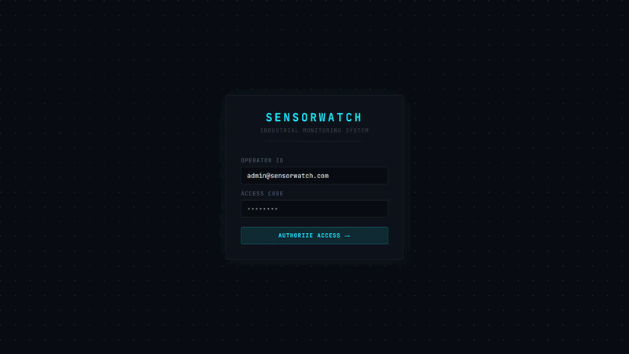
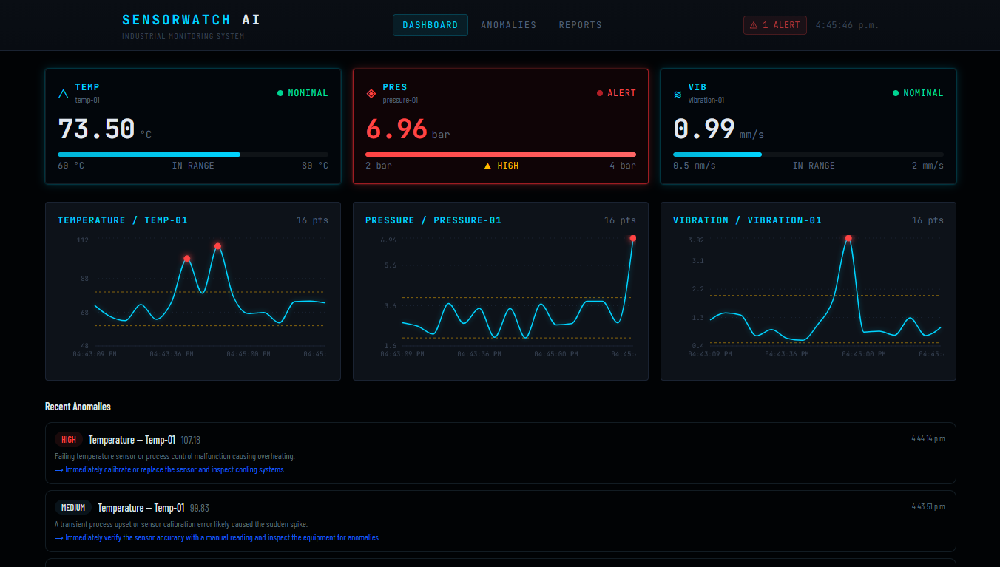
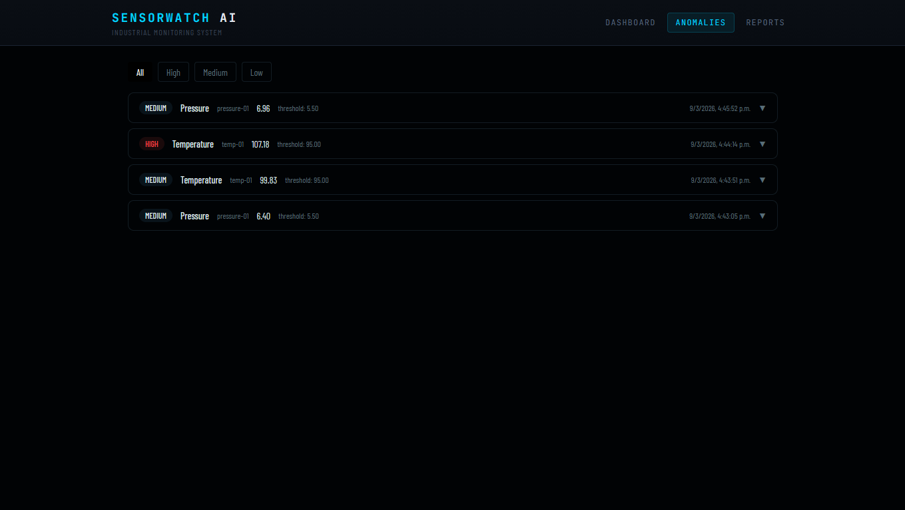

# SensorWatch AI

Real-time industrial sensor monitoring dashboard with AI-powered anomaly detection.

Built to demonstrate full-stack engineering with LLM integration — the kind of system used in manufacturing, energy, and industrial IoT environments.

**Live demo:** [sensorwatch-ai.vercel.app](https://sensorwatch-ai.vercel.app)  
**Login:** `admin@sensorwatch.com` / `admin123`

---

## What it does

- Monitors 3 industrial sensors (temperature, pressure, vibration) in real-time
- Detects anomalies automatically when readings exceed configurable thresholds
- Calls an LLM to analyze each anomaly and generate actionable maintenance recommendations
- Stores full event history with AI analysis for audit trails
- Generates weekly AI reports summarizing sensor performance and patterns
- Secured with JWT-based authentication

---

### Video Demo



## Tech stack

| Layer | Technology |
|-------|-----------|
| Frontend | Next.js 14, TypeScript, Tailwind CSS, shadcn/ui |
| Data viz | Recharts |
| Backend | Next.js API Routes |
| Database | PostgreSQL (Neon), Prisma ORM |
| AI | OpenRouter API (DeepSeek/StepFun) via OpenAI SDK |
| Auth | NextAuth.js with JWT strategy |
| Deploy | Vercel |

---

## Architecture decisions

**Why a single `/simulate` endpoint handles both reading generation and anomaly detection:**  
Anomaly detection must happen atomically with the reading. Splitting into two endpoints would create a race condition where readings could be fetched before anomalies are processed.

**Why OpenAI SDK with OpenRouter instead of a provider-specific SDK:**  
Provider-agnostic setup means switching models requires changing one string. The app originally used DeepSeek directly — migrating to OpenRouter took 2 lines of code.

**Why Neon for PostgreSQL:**  
Serverless connection pooling works correctly with Next.js API routes, which are stateless by nature. Traditional PostgreSQL connection pools exhaust connections under serverless scaling.

**Why polling instead of WebSockets:**  
For a demo/portfolio context, polling every 3-5 seconds is simpler to deploy and debug. WebSockets would require a persistent server — incompatible with Vercel's serverless model without additional infrastructure.

---

## Local setup
```bash
git clone https://github.com/RonaldGGA/sensorwatch-ai
cd sensorwatch-ai
npm install
```

Create `.env`:
```env
DATABASE_URL="postgresql://..."
OPENROUTER_API_KEY="sk-or-v1-..."
NEXTAUTH_SECRET="your-secret"
NEXTAUTH_URL="http://localhost:3000"
```
```bash
npx prisma migrate dev
npx tsx scripts/seed-admin.ts
npm run dev
```

---

## Project structure
```
app/
├── api/
│   ├── sensors/simulate/    # Generates readings + triggers AI analysis
│   ├── sensors/latest/      # Fetches recent readings per sensor
│   ├── anomalies/           # recent + all endpoints
│   └── reports/             # generate + all endpoints
├── anomalies/               # Anomaly history with expandable AI analysis
├── reports/                 # Weekly AI reports
└── login/                   # Auth page

components/dashboard/
├── StatusCard.tsx           # Per-sensor status with range indicator
└── SensorChart.tsx          # Time-series chart with anomaly markers

lib/
├── sensors.ts               # Sensor simulation logic
├── stepfun-ai.ts            # LLM client (OpenRouter)
└── prisma.ts                # DB client
```

---

## Screenshots




---

Built by [Ronald González](https://github.com/RonaldGGA) · [Portfolio](https://portfolio-ronalddearmas.vercel.app)